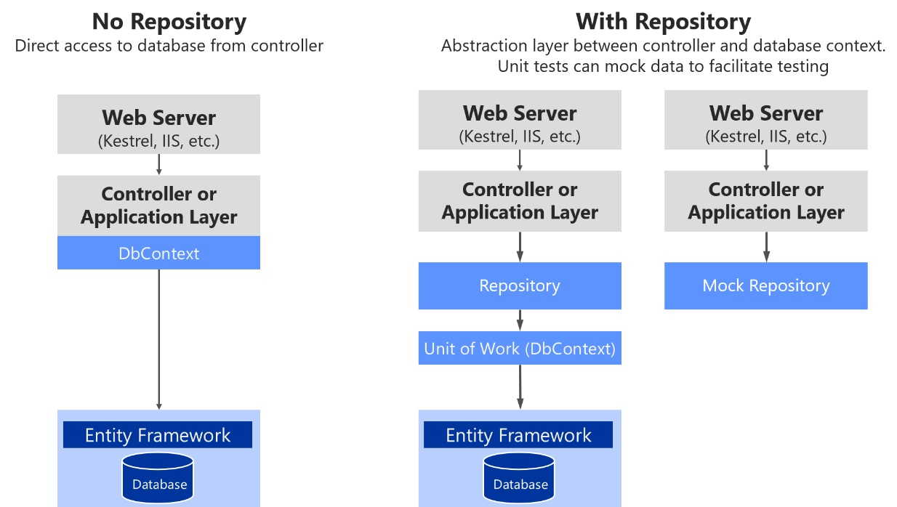
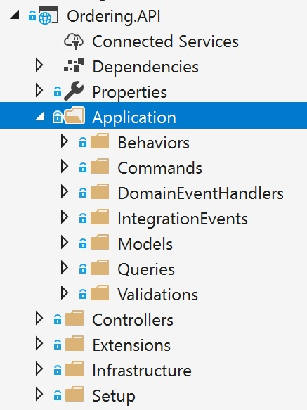

# Domain Driven Design
* https://docs.microsoft.com/en-us/dotnet/standard/microservices-architecture/microservice-ddd-cqrs-patterns/microservice-domain-model

# Entities

# Value Objects
* https://docs.microsoft.com/en-us/ef/core/modeling/owned-entities

# Aggregates

# Layers
1. Application
2. Domain
3. Infrastructure

# .NET Core Domain Model
* https://docs.microsoft.com/en-us/dotnet/standard/microservices-architecture/microservice-ddd-cqrs-patterns/net-core-microservice-domain-model
* https://docs.microsoft.com/en-us/dotnet/standard/microservices-architecture/microservice-ddd-cqrs-patterns/seedwork-domain-model-base-classes-interfaces

# Domain Events
* https://docs.microsoft.com/en-us/dotnet/standard/microservices-architecture/microservice-ddd-cqrs-patterns/domain-events-design-implementation
* The event handlers are typically in the application layer, because you will use infrastructure objects like repositories or an application API for the microservice’s behavior. In that sense, event handlers are similar to command handlers, so both are part of the application layer. The important difference is that a command should be processed only once. A domain event could be processed zero or n times, because it can be received by multiple receivers or event handlers with a different purpose for each handler.

# EF Core Persistence
* https://docs.microsoft.com/en-us/dotnet/standard/microservices-architecture/microservice-ddd-cqrs-patterns/infrastructure-persistence-layer-implemenation-entity-framework-core
* Repositories only for Aggregates
* Repository’s lifetime should usually be set as scoped (InstancePerLifetimeScope in Autofac). It could also be transient (InstancePerDependency in Autofac), but your service will be more efficient in regards memory when using the scoped lifetime.
* The Repository pattern allows you to easily test your application with unit tests. Remember that unit tests only test your code, not infrastructure, so the repository abstractions make it easier to achieve that goal.
* it's recommended that you define and place the repository interfaces in the domain model layer so the application layer, such as your Web API microservice, doesn't depend directly on the infrastructure layer where you've implemented the actual repository classes. By doing this and using Dependency Injection in the controllers of your Web API, you can implement mock repositories that return fake data instead of data from the database. This decoupled approach allows you to create and run unit tests that focus the logic of your application without requiring connectivity to the database.

# Mongo and Azure Cosmos
* https://docs.microsoft.com/en-us/dotnet/standard/microservices-architecture/microservice-ddd-cqrs-patterns/nosql-database-persistence-infrastructure

# Validation
* https://docs.microsoft.com/en-us/dotnet/standard/microservices-architecture/microservice-ddd-cqrs-patterns/domain-model-layer-validations
* It is easier to duplicate validation logic than to keep it consistent across application layers.
* In enterprise applications it is more important not to couple the server side to the client side than to follow the DRY principle.

# Application Layer
* https://docs.microsoft.com/en-us/dotnet/standard/microservices-architecture/microservice-ddd-cqrs-patterns/microservice-application-layer-web-api-design
* https://docs.microsoft.com/en-us/dotnet/standard/microservices-architecture/microservice-ddd-cqrs-patterns/microservice-application-layer-implementation-web-api
* https://lostechies.com/jimmybogard/2008/08/21/services-in-domain-driven-design/
* The application layer can be implemented as part of the artifact (assembly) you are building, such as within a Web API project or an MVC web app project. In the case of a microservice built with ASP.NET Core, the application layer will usually be your Web API library. If you want to separate what is coming from ASP.NET Core (its infrastructure plus your controllers) from your custom application layer code, you could also place your application layer in a separate class library, but that is optional.
* An important characteristic of a command is that it should be processed just once by a single receiver. This is because a command is a single action or transaction you want to perform in the application. For example, the same order creation command should not be processed more than once. This is an important difference between commands and events. Events may be processed multiple times, because many systems or microservices might be interested in the event.
* Some developers make their UI request objects separate from their command DTOs, but that is just a matter of preference. It is a tedious separation with not much added value, and the objects are almost exactly the same shape.
* You send a command to a single receiver; you do not publish a command. Publishing is for events that state a fact—that something has happened and might be interesting for event receivers. In the case of events, the publisher has no concerns about which receivers get the event or what they do it. But domain or integration events are a different story already introduced in previous sections.
* A mediator is an object that encapsulates the “how” of this process: it coordinates execution based on state, the way a command handler is invoked, or the payload you provide to the handler. With a mediator component you can apply cross-cutting concerns in a centralized and transparent way by applying decorators (or pipeline behaviors since MediatR 3). For more information, see the Decorator pattern.
* Decorators and behaviors are similar to Aspect Oriented Programming (AOP), only applied to a specific process pipeline managed by the mediator component. Aspects in AOP that implement cross-cutting concerns are applied based on aspect weavers injected at compilation time or based on object call interception. Both typical AOP approaches are sometimes said to work "like magic," because it is not easy to see how AOP does its work. When dealing with serious issues or bugs, AOP can be difficult to debug. On the other hand, these decorators/behaviors are explicit and applied only in the context of the mediator, so debugging is much more predictable and easy.

 

 

# API Gateways
* https://docs.microsoft.com/en-us/dotnet/standard/microservices-architecture/architect-microservice-container-applications/direct-client-to-microservice-communication-versus-the-api-gateway-pattern

