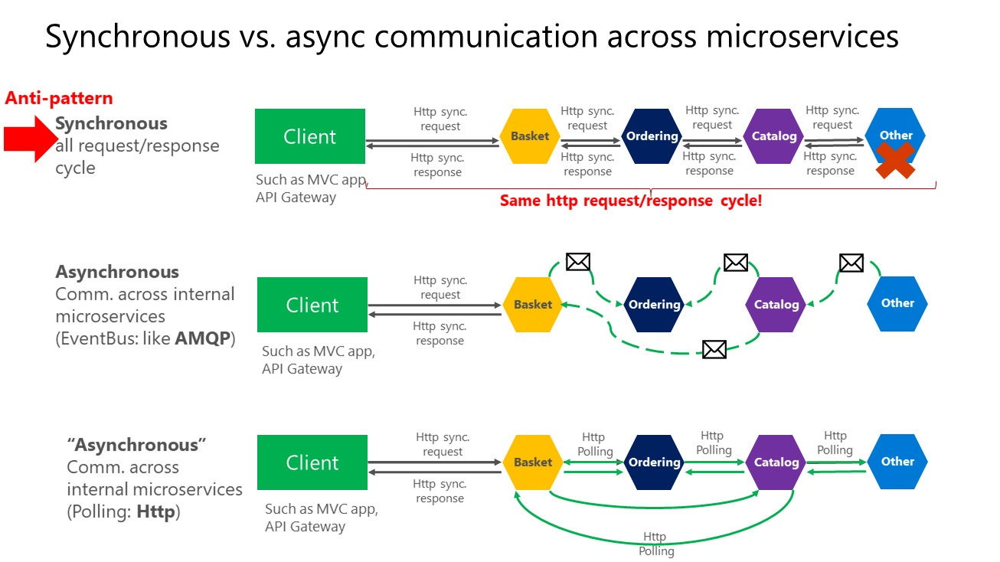

# Microservices and Domain Driven Design
* https://docs.microsoft.com/en-us/dotnet/standard/microservices-architecture/microservice-ddd-cqrs-patterns/microservice-domain-model
* https://docs.microsoft.com/en-us/dotnet/standard/microservices-architecture/architect-microservice-container-applications/data-sovereignty-per-microservice
* A microservices architecture is an approach to building a server application as a set of small services. That means a microservices architecture is mainly oriented to the back-end, although the approach is also being used for the front end. Each service runs in its own process and communicates with other processes using protocols such as HTTP/HTTPS, WebSockets, or AMQP. Each microservice implements a specific end-to-end domain or business capability within a certain context boundary, and each must be developed autonomously and be deployable independently. Finally, each microservice should own its related domain data model and domain logic (sovereignty and decentralized data management) and could be based on different data storage technologies (SQL, NoSQL) and different programming languages.
* An important rule for microservices architecture is that each microservice must own its domain data and logic. Just as a full application owns its logic and data, so must each microservice own its logic and data under an autonomous lifecycle, with independent deployment per microservice.
* Why a microservices architecture? In short, it provides long-term agility. Microservices enable better maintainability in complex, large, and highly-scalable systems by letting you create applications based on many independently deployable services that each have granular and autonomous lifecycles.

## Logical vs physical architecture
* a business microservice or Bounded Context is a logical architecture that might coincide (or not) with physical architecture. The important point is that a business microservice or Bounded Context must be autonomous by allowing code and state to be independently versioned, deployed, and scaled.
* The services in the example share the same data model because the Web API service targets the same data as the Search service. So, in the physical implementation of the business microservice, you're splitting that functionality so you can scale each of those internal services up or down as needed. Maybe the Web API service usually needs more instances than the Search service, or vice versa.

## DDD
### Bounded Context
* https://martinfowler.com/bliki/BoundedContext.html
* DDD deals with large models by dividing them into multiple BCs and being explicit about their boundaries. Each BC must have its own model and database.
* A microservice is therefore like a Bounded Context, but it also specifies that it's a distributed service. It's built as a separate process for each Bounded Context, and it must use the distributed protocols noted earlier, like HTTP/HTTPS, WebSockets, or AMQP. The Bounded Context pattern, however, doesn't specify whether the Bounded Context is a distributed service or if it's simply a logical boundary (such as a generic subsystem) within a monolithic-deployment application.

### Entities

### Value Objects
* https://docs.microsoft.com/en-us/ef/core/modeling/owned-entities

## Aggregates

## Layers
1. Application
2. Domain
3. Infrastructure

## Domain Model
* https://docs.microsoft.com/en-us/dotnet/standard/microservices-architecture/microservice-ddd-cqrs-patterns/net-core-microservice-domain-model
* https://docs.microsoft.com/en-us/dotnet/standard/microservices-architecture/microservice-ddd-cqrs-patterns/seedwork-domain-model-base-classes-interfaces
*  Each aggregate is a group of domain entities and value objects, although you could have an aggregate composed of a single domain entity (the aggregate root or root entity) as well.
*  The domain model layer includes the repository contracts (interfaces) that are the infrastructure requirements of your domain model. In other words, these interfaces express what repositories and the methods the infrastructure layer must implement. It is critical that the implementation of the repositories be placed outside of the domain model layer, in the infrastructure layer library, so the domain model layer is not “contaminated” by API or classes from infrastructure technologies, like Entity Framework.

## Domain Events
* https://docs.microsoft.com/en-us/dotnet/standard/microservices-architecture/microservice-ddd-cqrs-patterns/domain-events-design-implementation
* The event handlers are typically in the application layer, because you will use infrastructure objects like repositories or an application API for the microservice’s behavior. In that sense, event handlers are similar to command handlers, so both are part of the application layer. The important difference is that a command should be processed only once. A domain event could be processed zero or n times, because it can be received by multiple receivers or event handlers with a different purpose for each handler.
* The domain events and their side effects (the actions triggered afterwards that are managed by event handlers) should occur almost immediately, usually in-process, and within the same domain. Thus, domain events could be synchronous or asynchronous. Integration events, however, should always be asynchronous.
* You might sometimes want to propagate events across multiple microservices. That propagation is an integration event, and it could be published through an event bus from any specific domain event handler.

## Integration Events vs Domain Events
* https://docs.microsoft.com/en-us/dotnet/standard/microservices-architecture/multi-container-microservice-net-applications/integration-event-based-microservice-communications
* https://blogs.msdn.microsoft.com/cesardelatorre/2017/02/07/domain-events-vs-integration-events-in-domain-driven-design-and-microservices-architectures/
* Semantically, domain and integration events are the same thing: notifications about something that just happened. However, their implementation must be different. Domain events are just messages pushed to a domain event dispatcher, which could be implemented as an in-memory mediator based on an IoC container or any other method.
* On the other hand, the purpose of integration events is to propagate committed transactions and updates to additional subsystems, whether they are other microservices, Bounded Contexts or even external applications. Hence, they should occur only if the entity is successfully persisted, otherwise it's as if the entire operation never happened.
* Integration events must be based on asynchronous communication between multiple microservices (other Bounded Contexts) or even external systems/applications.
* The event bus interface needs some infrastructure that allows inter-process and distributed communication between potentially remote services. It can be based on a commercial service bus, queues, a shared database used as a mailbox, or any other distributed and ideally push based messaging system.
* Integration events are used for bringing domain state in sync across multiple microservices or external systems. This is done by publishing integration events outside the microservice. When an event is published to multiple receiver microservices (to as many microservices as are subscribed to the integration event), the appropriate event handler in each receiver microservice handles the event.
* The integration events can be defined at the application level of each microservice, so they are decoupled from other microservices, in a way comparable to how ViewModels are defined in the server and client. What is not recommended is sharing a common integration events library across multiple microservices; doing that would be coupling those microservices with a single event definition data library. You do not want to do that for the same reasons that you do not want to share a common domain model across multiple microservices: microservices must be completely autonomous.
* The purpose of the Publish/Subscribe pattern is the same as the Observer pattern: you want to notify other services when certain events take place. But there is an important difference between the Observer and Pub/Sub patterns. In the observer pattern, the broadcast is performed directly from the observable to the observers, so they “know” each other. But when using a Pub/Sub pattern, there is a third component, called broker or message broker or event bus, which is known by both the publisher and subscriber. Therefore, when using the Pub/Sub pattern the publisher and the subscribers are precisely decoupled thanks to the mentioned event bus or message broker.
* Because of that asynchronous communication, you should not publish integration events until you are 100% sure that your original operation, the event, really happened in the past. That means it was persisted in a database or any durable system. If you don’t do that, you can end up with inconsistent information across multiple microservices, bounded-contexts or external applications.
* Of course, you might want to propagate some Domain Events to other microservices or bounded-contexts. The point is that you’d convert the domain event to an integration event (or aggregate multiple domain events into a single integration event) and publish it to the outside world after making sure that the original transaction is committed, after “it really happened” in the past in your original system, which is the real definition of an event.

## Domain Events as Integration Events
* https://blogs.msdn.microsoft.com/cesardelatorre/2017/02/07/domain-events-vs-integration-events-in-domain-driven-design-and-microservices-architectures/
* As another possible approach, when you raise a domain event, it would also be queued to a CommitedEvent Queue once the transaction was successfully finished. Then, you would have 2 types of handlers. DomainEventHandler and CommitedEventHandler.
* You could extend any of those classes. If you need to handle the event immediately (internal domain operation), you would use a "normal" DomainEventHandler. If you need Commited data (ex: your handler relies on queries over stored data) you use a CommitedDomainEventHandler which would be pretty similar to handling an integration event.
* At the end of the day, it is pretty similar to having domain events and integration events but using the same definition of event going through different channels depending on the state (committed vs. not committed event).

## Communication
* https://docs.microsoft.com/en-us/dotnet/standard/microservices-architecture/architect-microservice-container-applications/communication-in-microservice-architecture
* If your microservice needs to raise an additional action in another microservice, if possible, do not perform that action synchronously and as part of the original microservice request and reply operation. Instead, do it asynchronously (using asynchronous messaging or integration events, queues, etc.). But, as much as possible, do not invoke the action synchronously as part of the original synchronous request and reply operation.
* And finally (and this is where most of the issues arise when building microservices), if your initial microservice needs data that's originally owned by other microservices, do not rely on making synchronous requests for that data. Instead, replicate or propagate that data (only the attributes you need) into the initial service's database by using eventual consistency (typically by using integration events, as explained in upcoming sections).
* As noted earlier in the section Identifying domain-model boundaries for each microservice, duplicating some data across several microservices isn't an incorrect design—on the contrary, when doing that you can translate the data into the specific language or terms of that additional domain or Bounded Context. For instance, in the eShopOnContainers application you have a microservice named identity.api that's in charge of most of the user's data with an entity named User. However, when you need to store data about the user within the Ordering microservice, you store it as a different entity named Buyer. The Buyer entity shares the same identity with the original User entity, but it might have only the few attributes needed by the Ordering domain, and not the whole user profile.
* You might use any protocol to communicate and propagate data asynchronously across microservices in order to have eventual consistency. As mentioned, you could use integration events using an event bus or message broker or you could even use HTTP by polling the other services instead. It doesn't matter. The important rule is to not create synchronous dependencies between your microservices.

## EF Core Persistence
* https://docs.microsoft.com/en-us/dotnet/standard/microservices-architecture/microservice-ddd-cqrs-patterns/infrastructure-persistence-layer-implemenation-entity-framework-core
* Repositories only for Aggregates
* Repository’s lifetime should usually be set as scoped (InstancePerLifetimeScope in Autofac). It could also be transient (InstancePerDependency in Autofac), but your service will be more efficient in regards memory when using the scoped lifetime.
* The Repository pattern allows you to easily test your application with unit tests. Remember that unit tests only test your code, not infrastructure, so the repository abstractions make it easier to achieve that goal.
* it's recommended that you define and place the repository interfaces in the domain model layer so the application layer, such as your Web API microservice, doesn't depend directly on the infrastructure layer where you've implemented the actual repository classes. By doing this and using Dependency Injection in the controllers of your Web API, you can implement mock repositories that return fake data instead of data from the database. This decoupled approach allows you to create and run unit tests that focus the logic of your application without requiring connectivity to the database.

## Mongo and Azure Cosmos
* https://docs.microsoft.com/en-us/dotnet/standard/microservices-architecture/microservice-ddd-cqrs-patterns/nosql-database-persistence-infrastructure

## Validation
* https://docs.microsoft.com/en-us/dotnet/standard/microservices-architecture/microservice-ddd-cqrs-patterns/domain-model-layer-validations
* It is easier to duplicate validation logic than to keep it consistent across application layers.
* In enterprise applications it is more important not to couple the server side to the client side than to follow the DRY principle.

## Application Layer
* https://docs.microsoft.com/en-us/dotnet/standard/microservices-architecture/microservice-ddd-cqrs-patterns/microservice-application-layer-web-api-design
* https://docs.microsoft.com/en-us/dotnet/standard/microservices-architecture/microservice-ddd-cqrs-patterns/microservice-application-layer-implementation-web-api
* https://lostechies.com/jimmybogard/2008/08/21/services-in-domain-driven-design/
* The application layer can be implemented as part of the artifact (assembly) you are building, such as within a Web API project or an MVC web app project. In the case of a microservice built with ASP.NET Core, the application layer will usually be your Web API library. If you want to separate what is coming from ASP.NET Core (its infrastructure plus your controllers) from your custom application layer code, you could also place your application layer in a separate class library, but that is optional.
* An important characteristic of a command is that it should be processed just once by a single receiver. This is because a command is a single action or transaction you want to perform in the application. For example, the same order creation command should not be processed more than once. This is an important difference between commands and events. Events may be processed multiple times, because many systems or microservices might be interested in the event.
* Some developers make their UI request objects separate from their command DTOs, but that is just a matter of preference. It is a tedious separation with not much added value, and the objects are almost exactly the same shape.
* You send a command to a single receiver; you do not publish a command. Publishing is for events that state a fact—that something has happened and might be interesting for event receivers. In the case of events, the publisher has no concerns about which receivers get the event or what they do it. But domain or integration events are a different story already introduced in previous sections.
* A mediator is an object that encapsulates the “how” of this process: it coordinates execution based on state, the way a command handler is invoked, or the payload you provide to the handler. With a mediator component you can apply cross-cutting concerns in a centralized and transparent way by applying decorators (or pipeline behaviors since MediatR 3). For more information, see the Decorator pattern.
* Decorators and behaviors are similar to Aspect Oriented Programming (AOP), only applied to a specific process pipeline managed by the mediator component. Aspects in AOP that implement cross-cutting concerns are applied based on aspect weavers injected at compilation time or based on object call interception. Both typical AOP approaches are sometimes said to work "like magic," because it is not easy to see how AOP does its work. When dealing with serious issues or bugs, AOP can be difficult to debug. On the other hand, these decorators/behaviors are explicit and applied only in the context of the mediator, so debugging is much more predictable and easy.

 

 

 ## User Interfaces
* https://docs.microsoft.com/en-us/dotnet/standard/microservices-architecture/architect-microservice-container-applications/microservice-based-composite-ui-shape-layout
* https://app.pluralsight.com/library/courses/micro-frontends-architecture/table-of-contents

## API Gateways
* https://docs.microsoft.com/en-us/dotnet/standard/microservices-architecture/architect-microservice-container-applications/direct-client-to-microservice-communication-versus-the-api-gateway-pattern

